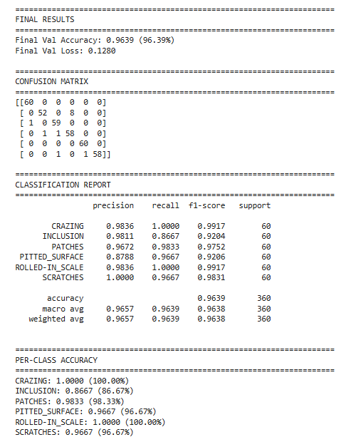
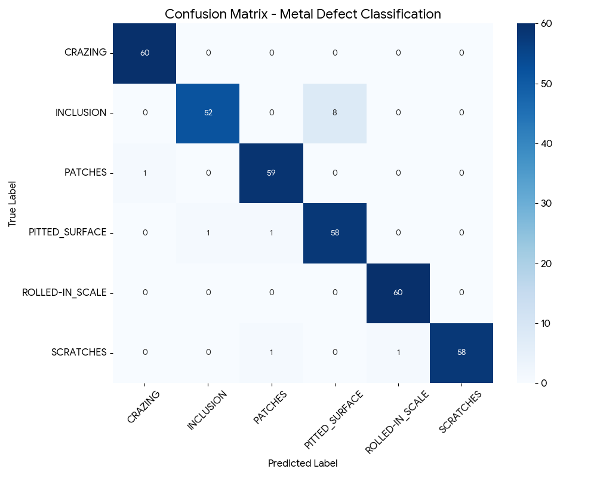

# Surface Defect Detection & Classification (NEU-DET)

This project focuses on detecting and classifying surface defects on steel images using deep learning techniques.

## Dataset
The NEU Surface Defect Dataset contains six types of surface defects:
- Crazing
- Inclusion
- Patches
- Pitted Surface
- Rolled-in Scale
- Scratches

## Methodology
- Developed a **custom CNN architecture** without using pre-trained models.
- Implemented both **image classification** and **object detection** pipelines.
- Focused on originality and model interpretability.

## Results
- Classification Accuracy: **96%**

### Accuracy Curve

### Confusion Matrix

- Object Detection mAP@0.5: **64.16%**

## Technologies
Python, PyTorch, OpenCV, NumPy, Matplotlib

